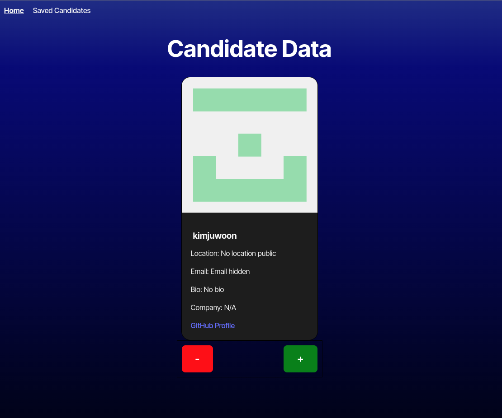

# CandidateSearch

- [Link to app](https://candidate-search2.netlify.app)

## Description
A React-based web application designed to help users search for candidate profiles based on various filters. This app leverages modern front-end development practices and is intended to serve as a useful tool for recruiters, hiring managers, or anyone needing to quickly find relevant candidates.

## Table of Contents
- [Installation](#installation)
- [Usage](#usage)
- [Technologies Used](#technologies-used)
- [How to Contribute](#how-to-contribute)
- [Questions](#questions)
- [Authors and acknowledgment](#authors-and-acknowledgment)
- [License](#license)

## Installation
run npm -i to install required packages 

## Usage
run npm start to run the app

features:
- Search Candidates: Use the search form to filter candidates by skill set, location, or other relevant criteria.
- View Profiles: Click on a candidate's name to view detailed information such as experience, education, and contact details.
- Save for Later: Bookmark candidates you may want to revisit.

## Technologies Used
- HTML5
- CSS3
- JavaScript
- React
- React Router
- Axios
- Git
- Netlify deploy

## How to Contribute
To contribute create a branch and open a pull request commenting the changes you want to implement

## Questions
You can reach me for questions at [github profile](https://github.com/marioxabel)

## Authors and acknowledgment
- Author: [Mario](https://github.com/marioxabel)
- This was a challenge for the [Tecnológico de Monterrey Coding Boot Camp](https://bootcamp.tec.mx/coding/)

## License
Distributed under the MIT License. [Click to see the full MIT license](https://choosealicense.com/licenses/MIT/).
